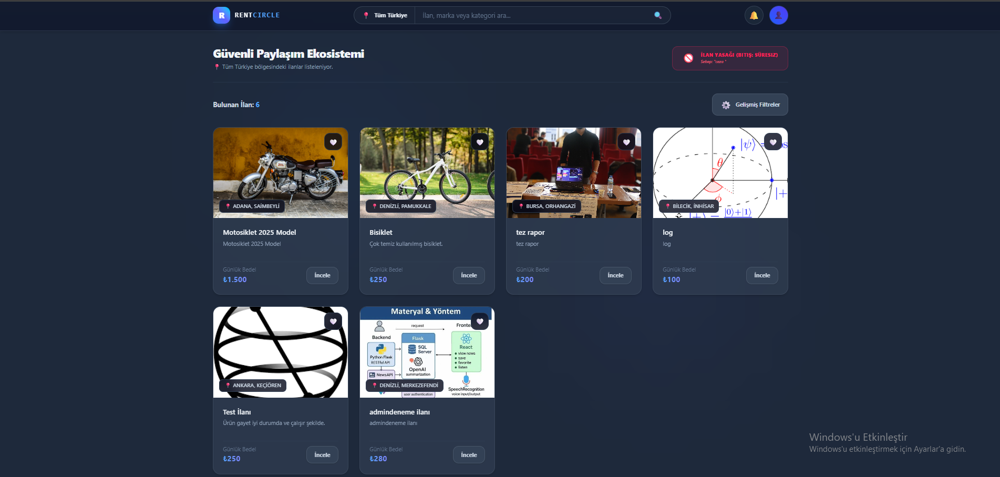
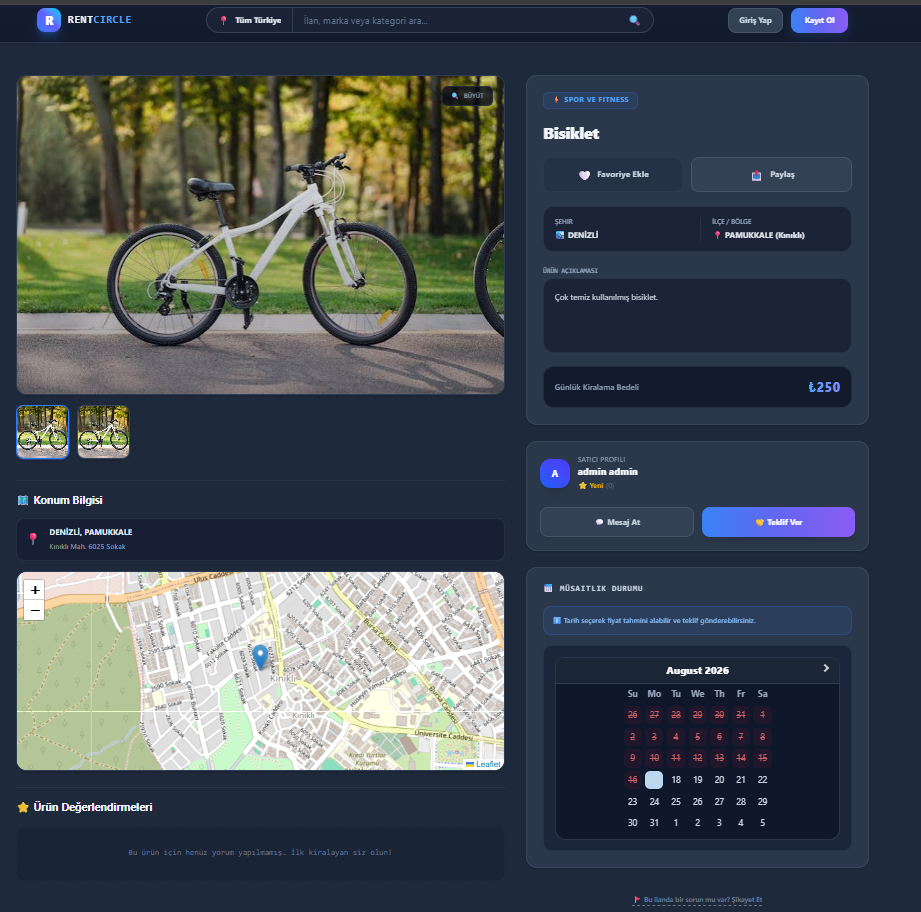
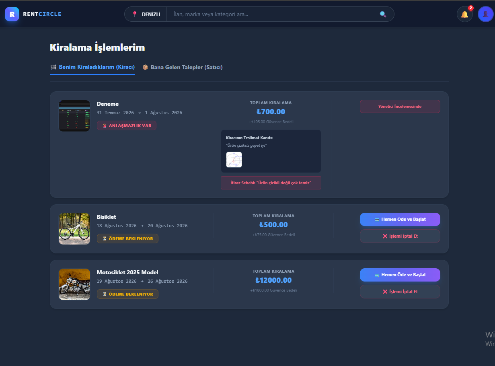
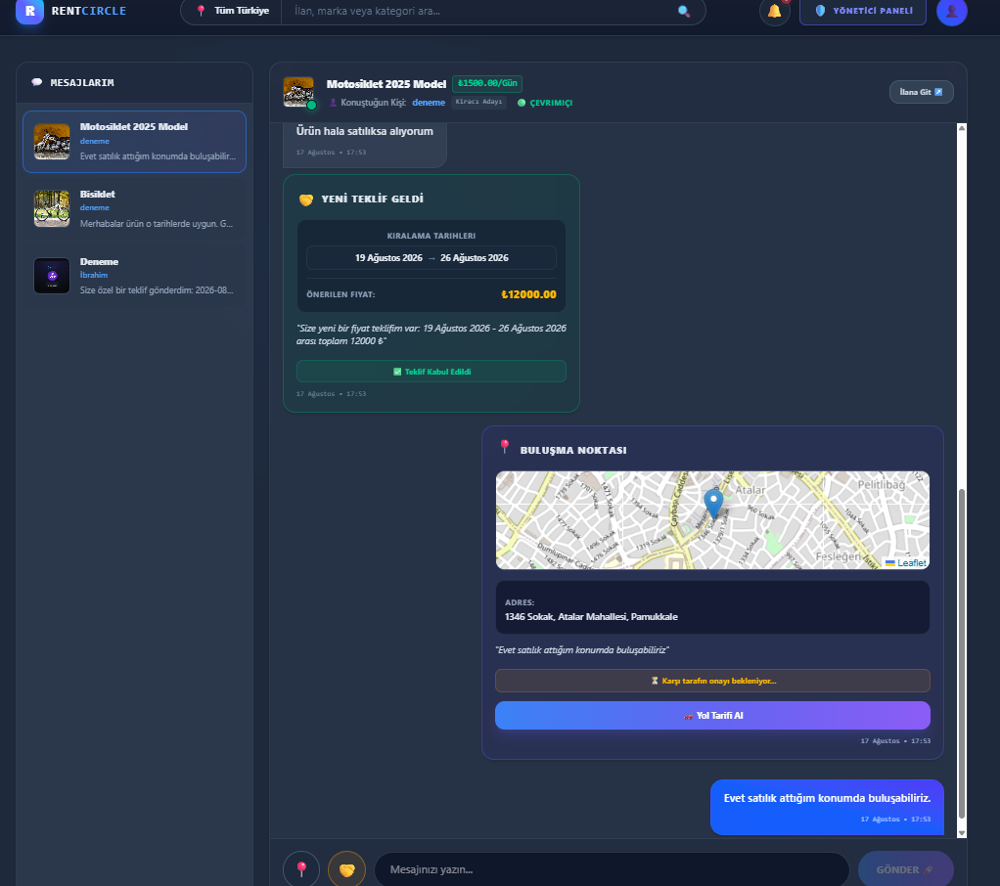
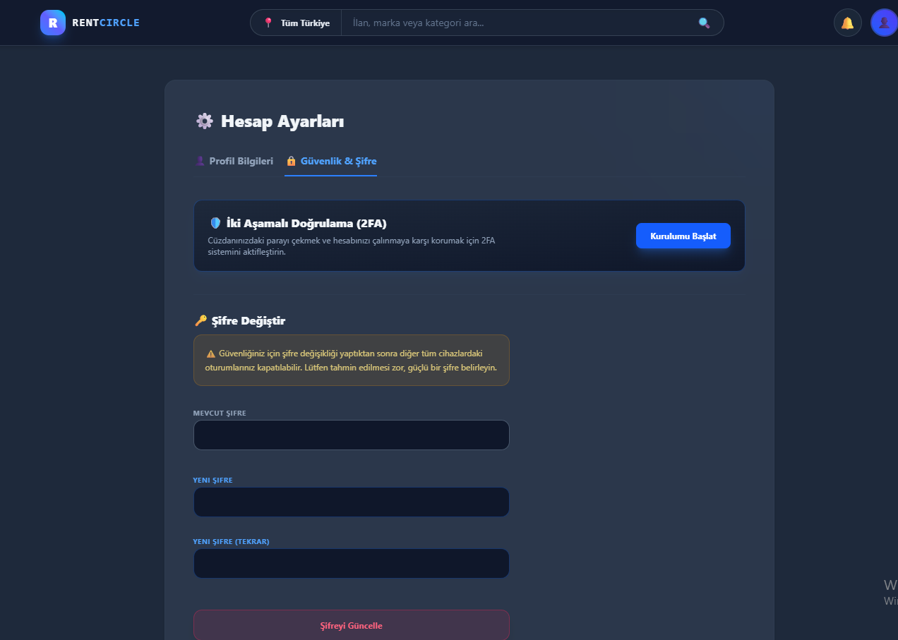
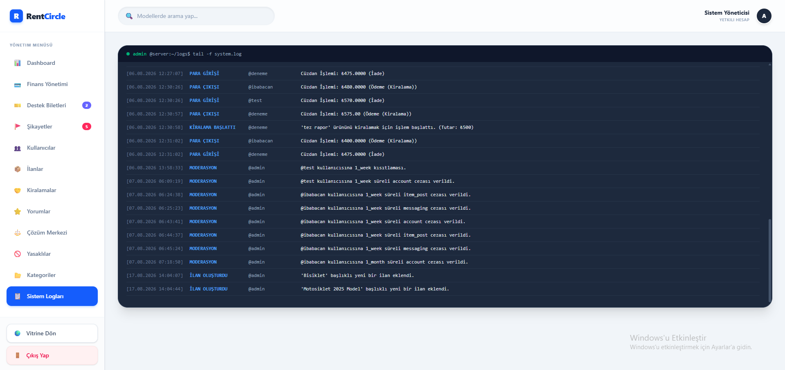
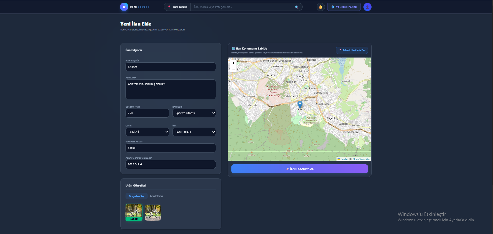
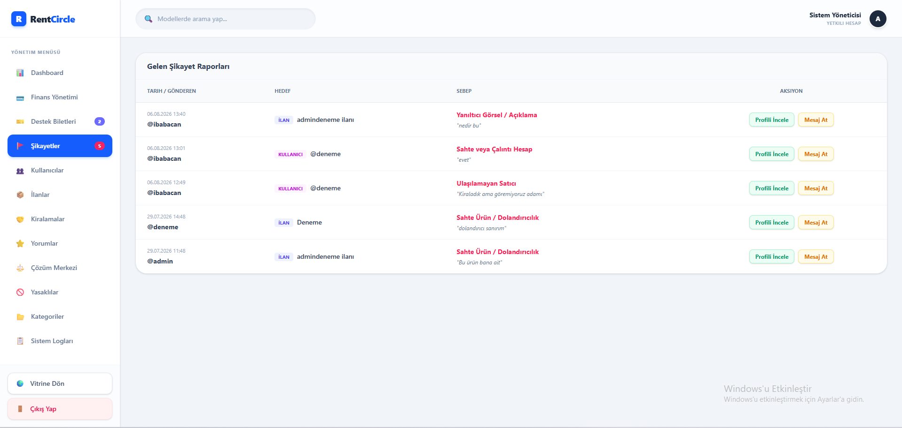
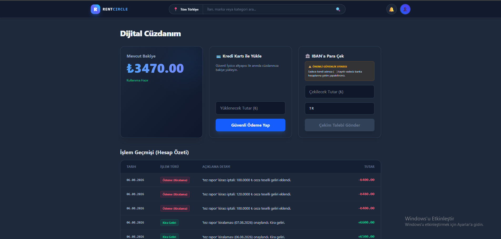

# 🔄 RentCircle - Güvenli Eşya Kiralama ve Paylaşım Platformu

📌 **Proje Hakkında**

RentCircle, kullanıcıların sahip oldukları eşyaları kiraya verebildiği veya ihtiyaç duydukları eşyaları diğer kullanıcılardan kiralayabildiği, üst düzey güvenlik odaklı bir Peer-to-Peer (P2P) eşya kiralama ve paylaşım platformudur.

Platform; ilan yönetimi, interaktif rezervasyon, güvenli havuz ödeme sistemi, dijital cüzdan, gerçek zamanlı mesajlaşma, fiyat pazarlığı, harita üzerinden konum paylaşımı, kullanıcı değerlendirme ve çok katmanlı moderasyon mekanizmalarını tek bir ekosistem altında birleştirir.

---

## 🚀 Öne Çıkan Özellikler

### 🔐 Zero-Trust Güvenli Ödeme Sistemi

RentCircle'da ödeme süreci doğrudan satıcıya para gönderme mantığıyla çalışmaz. Ödeme akışı, marketplace yapısına uygun şekilde **iyzico altyapısı** üzerinden gerçekleştirilir.

Platform ayrıca kullanıcıların kazançlarını yönetebildiği kapsamlı bir dijital cüzdan sistemi sunar.

### ⚡ Gerçek Zamanlı Sohbet ve Pazarlık

`Django Channels`, `WebSocket`, `ASGI` ve `Redis` teknolojileriyle donatılmış canlı mesajlaşma altyapısı sayesinde kullanıcılar:

- Gecikmesiz (Real-time) mesajlaşabilir.
- Kiralama fiyatı için özel teklif (Offer) gönderebilir ve yönetebilir.
- Sohbet içerisinden anlık konum (Harita Pini) paylaşabilir ve buluşma noktası belirleyebilir.

### 📍 Harita ve Konum Entegrasyonu

Kullanıcılar sisteme ürün eklerken eşyanın bulunduğu konumu harita üzerinden seçebilir. Kiralama sürecinde kiracı ve eşya sahibi, OpenStreetMap ve React Leaflet altyapısıyla teslimat noktalarını doğrudan platform üzerinden şeffafça belirler.

### 🔎 Gelişmiş Arama ve Kapsamlı Filtreleme

İhtiyaç duyulan ürüne en hızlı şekilde ulaşmak için dinamik filtreleme motoru geliştirilmiştir:

- Anahtar kelimeye göre arama
- Kategori bazlı listeleme
- Şehir ve İlçe bazlı konum filtreleme
- Minimum ve Maksimum Fiyat aralığı
- İlanın güncel aktiflik/müsaitlik durumu

### ⭐ Değerlendirme, Destek ve Ticket Sistemi

- **Puanlama ve Yorum (Review):** Kiralama işlemi tamamlandıktan sonra kullanıcılar birbirlerini puanlayabilir ve deneyimlerini yorumlayarak platform güvenilirliğini artırır.
- **Destek ve Şikayet (Ticket):** Kullanıcılar karşılaştıkları sorunlar, şikayetler veya ilan itirazları için sistem üzerinden doğrudan yöneticilere "Destek Bileti" oluşturabilir.

### 🔑 Kimlik Doğrulama, 2FA ve Hesap Yönetimi

Gelişmiş "Auth" işlemleri sayesinde kullanıcılar profil bilgilerini güncelleyebilir ve şifre değiştirme işlemlerini güvenle yapabilir. Hassas finansal işlemler (Örn: Cüzdandan IBAN'a para çekme) **TOTP tabanlı 2FA (Google Authenticator)** kodu girilmeden kesinlikle gerçekleştirilemez.

### 🛡️ Çok Katmanlı Moderasyon ve Ceza Sistemi

Yöneticiler kullanıcılar üzerinde İlan Yasağı, Mesajlaşma Yasağı, Geçici veya Süresiz Hesap Banı gibi kısıtlamalar uygulayabilir. **Silent Polling** mekanizması sayesinde, ceza alan aktif kullanıcıların ekranlarındaki kısıtlamalar sayfayı yenilemeye dahi gerek kalmadan anında devreye girer.

---

## 🏗️ Sistem Mimarisi

```text
                         ┌──────────────────────┐
                         │      React UI        │
                         │    Vite + Tailwind   │
                         └──────────┬───────────┘
                                    │
                         REST API / WebSocket
                                    │
                                    ▼
                         ┌──────────────────────┐
                         │        Django        │
                         │         DRF          │
                         └──────────┬───────────┘
                                    │
               ┌────────────────────┼────────────────────┐
               ▼                    ▼                    ▼
       ┌──────────────┐     ┌──────────────┐    ┌──────────────┐
       │ PostgreSQL   │     │    Redis     │    │    iyzico    │
       │   / SQLite   │     │  Channels    │    │   Payments   │
       └──────────────┘     └──────────────┘    └──────────────┘
```

---

## 🖥️ Ekran Görüntüleri

### 1. Ana Vitrin ve Gelişmiş Arama



### 2. İlan Detayları ve Rezervasyon




### 3. Gerçek Zamanlı Sohbet ve Pazarlık



### 4. Profil Güvenlik - 2FA ve Şifre Değiştirme



### 5. Admin - Loglar



### 6. Ürün Ekleme



### 7. Destek Biletleri (Tickets)



### 8. Cüzdan Geçmişi



---

## 🛠️ Teknoloji Yığını

### Backend

| **Teknoloji**               | **Kullanım Alanı**                         |
| --------------------------- | ------------------------------------------ |
| **Python 3.12**             | Backend programlama dili                   |
| **Django 5.x**              | Web framework                              |
| **Django REST Framework**   | REST API Mimarisi                          |
| **Django Channels & Redis** | WebSocket & Gerçek zamanlı iletişim        |
| **SimpleJWT & PyOTP**       | Token Rotation & TOTP 2FA Kimlik doğrulama |
| **iyzico API**              | Ödeme altyapısı                            |

### Frontend

| **Teknoloji**                    | **Kullanım Alanı**                              |
| -------------------------------- | ----------------------------------------------- |
| **React (Vite)**                 | Kullanıcı arayüzü ve Build altyapısı            |
| **React Router v6**              | Sayfa yönlendirmeleri ve Korunan Route'lar      |
| **Tailwind CSS & Framer Motion** | Arayüz tasarımı ve Animasyonlar                 |
| **Axios**                        | HTTP istemcisi (Sessiz Yenileme ve Interceptor) |
| **React Leaflet & OSM**          | Harita ve konum entegrasyonu                    |

---

## 🔒 Güvenlik Mimarisi

Güvenlik, RentCircle'ın temel tasarım prensiplerinden biridir.

**Güvenlik Bileşenleri:**

- **Protected Routes (Korunan Route'lar):** Yetkisiz kullanıcıların URL üzerinden manuel sayfa erişimleri React seviyesinde engellenmiştir.
- JWT Authentication ve Token Rotation (Çalınan tokenlara karşı rotasyon)
- Permission tabanlı API erişimi ve Business Logic doğrulama
- TOTP tabanlı 2FA (Para çekme koruması)
- Dosya güvenlik kontrolleri (Magic Bytes DNA analizi)
- Çok katmanlı URL, Route Guarding ve Backend API zırhlaması

---

## 📁 Proje Yapısı

RentCircle, backend ve frontend uygulamalarını tek bir repository altında barındıran bir monorepo olarak yapılandırılmıştır. Önceden bağımsız olan projeler, geçmiş commit kayıtları (history) korunarak **Git Subtree** ile başarıyla birleştirilmiştir.

```text
RentCircle/
├── rentcircle-backend/     # Django API & WebSockets
├── rentcircle-frontend/    # React SPA
├── docs/images/            # Ekran Görüntüleri
├── LICENSE
└── README.md
```

---

## ⚙️ Kurulum Rehberi

### Gereksinimler

- Python 3.12+
- Node.js 20+
- Redis Server (WebSocket iletişiminin çalışması için aktif olmalıdır)

### 1. Repository'yi Klonlayın

```bash
git clone https://github.com/Babacanibrahim/RentCircle.git
cd RentCircle
```

### 2. Backend Kurulumu

```bash
cd rentcircle-backend
python -m venv venv

# Windows için:
venv\Scripts\activate

# Linux / macOS için:
source venv/bin/activate

# Bağımlılıkları yükleyin
pip install -r requirements.txt

# .env dosyasını oluşturun (İçini kendi servis bilgilerinizle doldurun)
copy .env.example .env

# Veritabanını oluşturun ve sunucuyu başlatın
python manage.py migrate
python manage.py runserver
```

### 3. Frontend Kurulumu

Yeni bir terminal açın:

```bash
cd rentcircle-frontend

npm install

# .env dosyasını oluşturun (İçini API adreslerinizle doldurun)
copy .env.example .env

npm run dev
```

> **🔑 Önemli Not:** Projenin sorunsuz çalışabilmesi için `.env` dosyaları içerisindeki gizli anahtarları (Redis URL, iyzico Key, SMTP mail bilgileri vb.) kendi servislerinizden alarak doldurmanız gerekmektedir. Bu dosyalar `.gitignore` ile korunmaktadır ve asla GitHub'a yüklenmemelidir.

---

## 📄 Lisans

Bu proje **MIT License** altında lisanslanmıştır. Dilediğiniz gibi inceleyebilir ve geliştirebilirsiniz. Kaynak kodların ticari veya kişisel kullanımı serbesttir.

---

## 👨‍💻 Geliştirici

**İbrahim Babacan**

_Bilgisayar Mühendisi | Backend Development & Cybersecurity_

- **GitHub:** [@Babacanibrahim](https://github.com/Babacanibrahim)
- **LinkedIn:** [20ibrahimbabacan20](https://linkedin.com/in/20ibrahimbabacan20)
- **E-posta:** babacan-1907@outlook.com.tr
